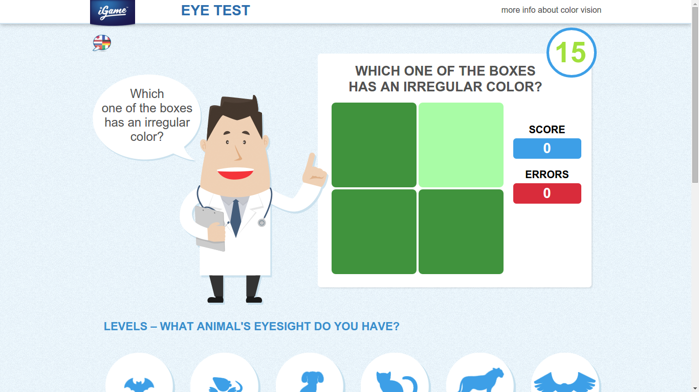
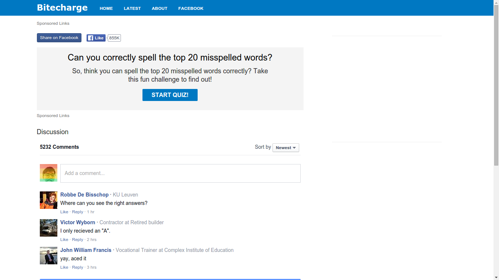

# List of cheat codes for web games

在瀏覽器中開啟 js 命令列，在適當的時機輸入即可

- Google chrome: ctrl + j

## arealme 系列

### chinese-poem

古詩詞衝刺100句

http://www.arealme.com/chinese-poem/zh/

```
$("#start").click();(function foo(i){var bar= $("#q"+i+"  p:not([value=0])");bar.css("background", "red");console.log(i);console.log(bar.text());if(i<100){setTimeout(function(){foo(i+1);bar.click();},1200)}})(1)
```


### geography

史上最難的世界地理測試

http://www.arealme.com/geography/zh/

```
(function foo(i){var bar= $("#q"+i+"  p:not([value=0])");console.log(bar.text());bar.click();if(i<74){setTimeout(function(){foo(i+1)},1000)}})(1)
Raw
```


## Eye test

http://wvw.igame.com/eye-test/?fbs=28

```
(function foo(){var i=0; function bar(){$($("iframe")[0].contentDocument.getElementsByClassName("thechosenone")).click();i++; if(i<100){setTimeout(bar, 100)}};bar()})()
```



## Can you correctly spell the top 20 misspelled words?

http://bitecharge.com/play/top20

```
$(".start-quiz").click();(function foo(i){btn = $("[data-href=\"#q%s.6e\"]".replace("%s",i)); console.log(btn.text());btn.click(); if(i<=20){setTimeout(function(){foo(i+1)}, 1000)}else if(i==21){setTimeout(function(){btn2 = $("[data-href=\"#r.6e\"]");console.log(btn2.text());btn2.click();},1000);};})(1)
```


